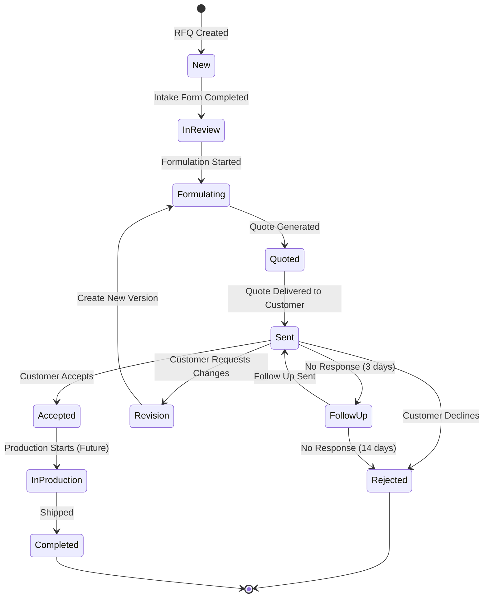
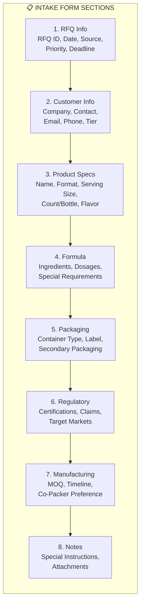
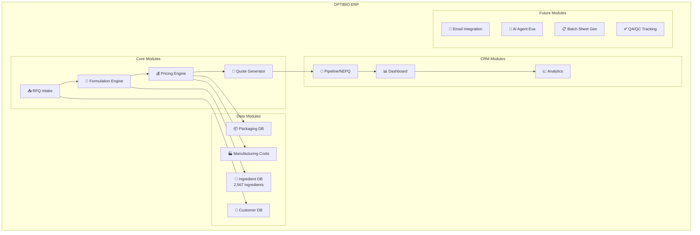

# Optibio ERP — Master Process Workflow

## Overview
Complete RFQ-to-Delivery workflow for nutraceutical supplement manufacturing brokerage.

```mermaid
flowchart TD
    subgraph INTAKE["📥 PHASE 1: INTAKE"]
        A1[Customer Email/Call] --> A2{New or Existing Customer?}
        A2 -->|New| A3[Create Customer Record]
        A2 -->|Existing| A4[Link to Customer]
        A3 --> A5[Create RFQ Record]
        A4 --> A5
        A5 --> A6{Has SFP Attachment?}
        A6 -->|Yes PDF/Image| A7[AI Extract Supplement Facts]
        A6 -->|No - Text Only| A8[Manual Entry]
        A6 -->|Excel/Spreadsheet| A9[Parse Excel Data]
        A7 --> A10[Auto-Fill Intake Form]
        A8 --> A10
        A9 --> A10
        A10 --> A11[Review & Complete Intake Form]
        A11 --> A12[RFQ Status: IN REVIEW]
    end

    subgraph FORMULATION["🧪 PHASE 2: FORMULATION"]
        A12 --> B1[Match Ingredients to DB]
        B1 --> B2{All Ingredients Found?}
        B2 -->|Yes| B3[Auto-Select Optimal Variants]
        B2 -->|Partial| B4[Flag Missing Ingredients]
        B2 -->|No Match| B5[Manual Ingredient Entry]
        B4 --> B3
        B5 --> B3
        B3 --> B6[Apply Active Content % Formula]
        B6 --> B7[Apply Dosage-Form Overage/Wastage]
        B7 --> B8{Capsule?}
        B8 -->|Yes| B9[Run Capsule Sizer]
        B8 -->|No| B10[Validate Tablet Weight]
        B9 --> B11[Calculate Excipients]
        B10 --> B11
        B11 --> B12[Complete Formulation]
        B12 --> B13[RFQ Status: FORMULATING]
    end

    subgraph COSTING["💰 PHASE 3: COSTING & QUOTE"]
        B13 --> C1[Part A: Raw Material Costs]
        C1 --> C2[Part B: Manufacturing Costs]
        C2 --> C3[Part C: Packaging Costs]
        C3 --> C4[Calculate Overhead 15%]
        C4 --> C5[Generate Tiered Pricing]
        C5 --> C6{Estimated Prices?}
        C6 -->|Yes| C7[Flag for Supplier Verification]
        C6 -->|No| C8[All Verified]
        C7 --> C8
        C8 --> C9[Generate PDF Quote]
        C9 --> C10[RFQ Status: QUOTED]
    end

    subgraph DELIVERY["📤 PHASE 4: QUOTE DELIVERY"]
        C10 --> D1[Internal Review]
        D1 --> D2{Approved?}
        D2 -->|Yes| D3[Send Quote to Customer]
        D2 -->|No| D4[Revise Quote]
        D4 --> C1
        D3 --> D5[RFQ Status: SENT]
        D5 --> D6{Customer Response?}
        D6 -->|Accepted| D7[RFQ Status: ACCEPTED]
        D6 -->|Rejected| D8[RFQ Status: REJECTED]
        D6 -->|Revise| D9[Create Quote v2]
        D6 -->|No Response| D10[Follow Up]
        D9 --> C1
        D10 --> D6
    end

    subgraph PRODUCTION["🏭 PHASE 5: PRODUCTION (Future)"]
        D7 --> E1[Generate Batch Sheet]
        E1 --> E2[Source Raw Materials]
        E2 --> E3[Manufacturing]
        E3 --> E4[QA/QC Testing]
        E4 --> E5[Packaging]
        E5 --> E6[Ship to Customer]
        E6 --> E7[RFQ Status: COMPLETED]
    end

    style INTAKE fill:#e8f5e9,stroke:#2e7d32,color:#000
    style FORMULATION fill:#e3f2fd,stroke:#1565c0,color:#000
    style COSTING fill:#fff3e0,stroke:#e65100,color:#000
    style DELIVERY fill:#f3e5f5,stroke:#7b1fa2,color:#000
    style PRODUCTION fill:#fce4ec,stroke:#c62828,color:#000
```

## RFQ Status Flow

## Intake Form Structure

## Module Map

